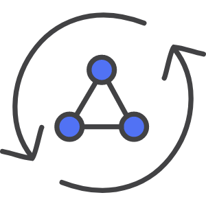

<div align="center">
    <h3>
        blog-app-aws-stack
    </h3>
</div>





## 📚 **Sobre**

 <p>Este projeto visa se aprofundar no desenvolvimento com a AWS aplicando o conjunto de ferramentas e serviços oferecido pelo AWS Amplify. </p>

Comandos úteis:

```bash
amplify init (provisiona o projeto no console da aws)
amplify console (abre o console da aws no navegador)
amplify push (sobe as alterações locais para a nuvem)
amplify add <category> (adiciona recurso de uma categoria)
amplify mock api (cria uma api local)
rm -r amplify/mock-data (apagar api mock)
amplify remove auth
amplify status (serviços/api ativos)
amplify delete (excluir projeto na nuvem)
```
